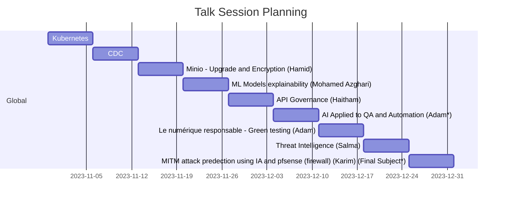

# education
Sample Codes for Education Purposes

```mermaid
gantt
    title Talk Session Planning
    dateFormat YYYY-MM-DD
    section Global
        Kubernetes:a, 2023-10-30, 1w
        CDC:b, after a, 1w
        Minio - Upgrade and Encryption (Hamid):c, after b, 1w
        ML Models explainability (Mohamed Azghari):d, after c, 1w
        API Governance (Haitham):e, after d, 1w
        AI Applied to QA and Automation (Adam*):f, after e, 1w
        Le numérique responsable - Green testing (Adam):g, after f, 1w
        Threat Intelligence (Salma):h, after g, 1w
        MITM attack predection using IA and pfsense (firewall) (Karim) (Final Subject*):i, after h, 1w
```
